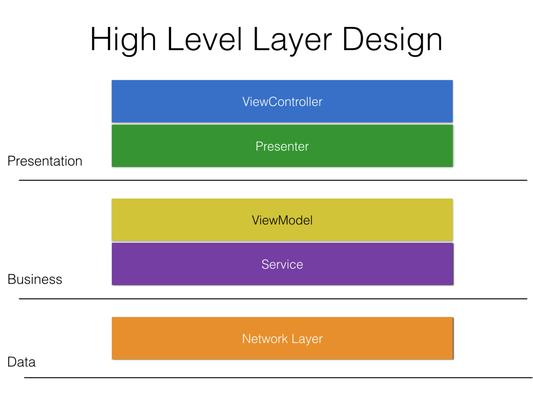
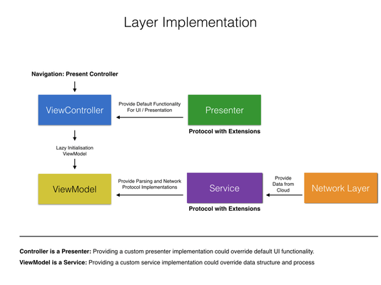
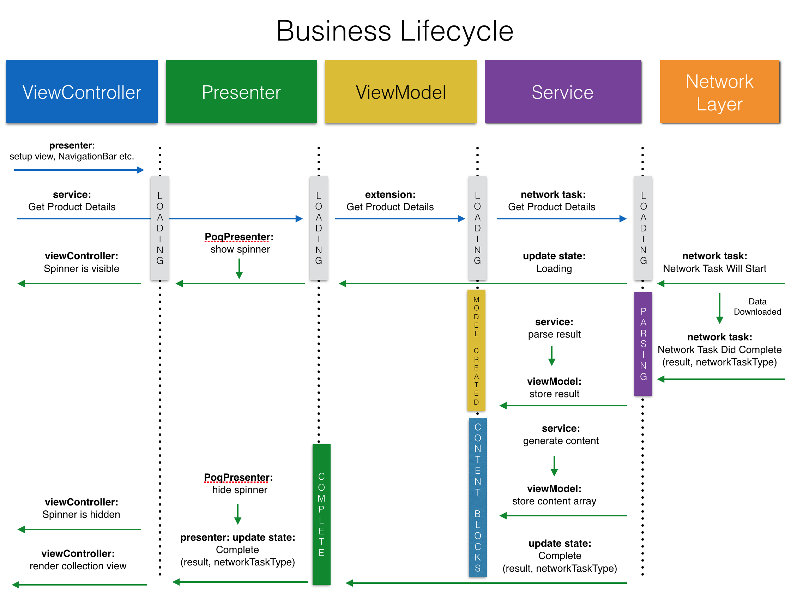

# Poq iOS Platform
==================

This is the Platform repository. 

Table of Contents
=================

- [Getting Started](#getting-started)
- [Documentation](#documentation)
- [Requirements](#requirements)
- [Architecture](#architecture)
  * [Design Decisions](#design-decisions)
  * [Presenter](#presenter)
  * [Service](#service)
- [UI/Layout](#ui-layout)
  * [iOS11](#ios11)
- [Pods used](#pods-used)
  * [Social](#social)
  * [Tracking](#tracking)
  * [Integration](#integration)
  * [UI UX](#uiux)
  * [Operational](#operational)
  * [AddressBook](#addressbook)
  * [Payment](#payment)
  * [Security](#security)
  * [iBeacon](#ibeacon)
  * [Tinder](#tinder)
  * [Test supports](#test-supports)
  * [Storage](#storage)
  * [Swiftlint](#swiftlint)
- [New Project Setup](#new-project-setup)
  * [Repository separation](#repository-separation)
  * [How to implement a new screen](#how-to-implement-a-new-screen)
  * [How to submit a fix](#how-to-submit-a-fix)
  * [How to override client](#how-to-override-client)
- [Collaboration](#collaboration)
  * [Guidelines for Pull Requests](#guidelines-for-pull-requests)
  * [Template for Pull Requests](#template-for-pull-requests)
  * [Style guide](#style-guide)
- [Build times](#build-times)
- [Change Log](#change-log)

## <a name="getting-started"></a>Getting Started
1. Make your own fork repository
2. TODO (i.e. clone repository
3. TODO

## <a name="documentation"></a>Documentation
We use [Jazzy](https://github.com/realm/jazzy).
Therefore documentation is automatically generated by making the right comments in the code. 
### Location
Jazzy makes documentation per Module and adds it to the folder:
`docs/<PlatformVersion>/<ModuleName>`

### Generation:

In order to generate 
Generate documentation for `PoqPlatform` Module:
`jazzy -x -workspace,Poq.iOS.Platform.xcworkspace,-scheme,PoqPlatform --output docs/v9.0/PoqPlatform`

Generate documentation for `PoqModuling` Module:
`jazzy -x -workspace,Poq.iOS.Platform.xcworkspace,-scheme,PoqModuling --output docs/v9.0/PoqModuling`

Generate documentation for `PoqNetworking` Module:
`jazzy -x -workspace,Poq.iOS.Platform.xcworkspace,-scheme,PoqNetworking --output docs/v9.0/PoqNetworking`

Generate documentation for `PoqUtilities` Module:
`jazzy -x -workspace,Poq.iOS.Platform.xcworkspace,-scheme,PoqUtilities --output docs/v9.0/PoqUtilities`

### Usage:

Swift documentation is written in markdown and supports a number of special keywords.
For a complete list and examples, see [*Swift header documentation in Xcode 7*](http://ericasadun.com/2015/06/14/swift-header-documentation-in-xcode-7/) and the [Xcode Markup Formatting Reference](https://developer.apple.com/library/content/documentation/Xcode/Reference/xcode_markup_formatting_ref/).

### Example:

```

   /**
    Creates `UIColor` object based on given hexadecimal color value
     
    - Parameter hex: String with the hex information. With or without hash symbol.
    - returns: A UIColor from the given String or gray UIColor if the String does not match the requirements.
    - Throws: `MyError.InvalidWhatever` We will provide this if the function throws
 
    ## Usage Example: ##
    ````
    let redHexColor = UIColor.hexColor("#ff0000")
    ````
    **Note:** You can make notes here aboit whatever you want. For example, I would like to refactor this function since it can be shorter and it uses blah blah
    */

``` 
You can find this example in the file [UIColorExtension.swift](PoqModuling/Sources/UIColorExtension.swift)


## <a name="requirements"></a>Requirements
TODO
## <a name="architecture"></a>Architecture
### <a name="design-decisions"></a>Design Decisions
After [Separation of Repositories v1(iOS)](https://poqcommerce.atlassian.net/wiki/pages/viewpage.action?pageId=57573517), the need for extending the default platform functionality become an issue.
In parallel to this, most of the new client projects nowadays focus on customisation starting from PDP. 

Regarding the above analysis, we decided to loosely couple ViewController from ViewModel further more and introduce abstraction in every possible scenario.
The best way to abstract functionality and keep layers light is actually to introduce [Protocol Oriented Programming](https://www.raywenderlich.com/148448/introducing-protocol-oriented-programming). 

By the power of POP, we can now introduce a default implementation to our protocols, in other words interfaces to customisation points.
These default implementations would be considered as default platform functionality/behaviours at the same time.
On top of these advantages, we also achieve a better testability to our core business logic by relying on protocols. 

To summarise, the above design principles led us to introduce two new layers, **Presenter** and **Service**, to our current MVVM architecture.
These layers are basically responsible for protocol designs and their default implementations. Also, by being a protocol, they can be easily overridden or replaced in client projects.
### <a name="presenter"></a>Presenter
The main purpose of this layer is to create abstraction in ViewController logic. The traditional [Object Oriented Programming](https://en.wikipedia.org/wiki/Object-oriented_programming) drives the architecture and implementation to Inheritance (Subclassing).
Although OOP solves so many fundamental problems, still to introduce a custom implementation or to override an existing functionality, a new controller/view model with so much unnecessary logic would be carried out.
In all of the previous attempts, we saw this has introduces loads of limitations.
To solve the above problem and any limitations introduced, Presenter implements the basic functionality of a view controller with platform default behaviours in mind. 
However, if a client prefers a new functionality, implementing a new Presenter and introducing to a bespoke view controller will be an easy solution.
### <a name="service"></a>Service
Previously, our View Model entities connect to Network Layer, parse related data and even generate views to be used in view controller. Initially, this was introduced to improve testability before [Protocol Oriented Programming](https://www.raywenderlich.com/148448/introducing-protocol-oriented-programming). However, these entities became more complex everyday and it has become so hard to extend or replace these components. Also, the strong dependency to a view controller turned these entities into 
some kind of concrete structures. 
To solve this problem, Service layer is introduced. This layer is basically responsible for three functionalities; networking, parsing and storage.

**Networking** is mainly implemented in Network Layer. However, the delegation for network operation tasks are still required to be implemented. At this point, a Service implements all required PoqNetworkingTaskDelegate. While implementing these delegates, a Service also sends updates to other layers using PoqPresenter view states.

**Parsing** of network result was handled in ViewModels which ended up having so many lines of code that is unnecessary for a View Model. Also, these parse operations are almost concrete and mostly unchanged. 
So it was an obvious choice to move these parsers to Service as well.

**Storage** is supposed to be handled at View Model layer in memory. Because the whole business at Poq driven by [Cloud](https://azure.microsoft.com/en-gb/), we haven't introduced a more complex storage mechanism like Core Data or SQL Lite yet. 
In this case, storage is handled by a relevant stored property in View Model instance assigned from default Service parser.


<p align="center">
    
</p>

As seen on the diagram, our new component architecture now includes 6 layers.

Previously, a thick ViewModel doing so much heavy lifting and a concrete view
controllers that is hard to extend were the first 2 layers up until Network Layer.
Now, the introduction of Presenter and Service entities made existing View Model
and View Controllers lighter as well as other benefits discussed above.
In this new architecture, we are going to be able to extend/replace each major 
component without effecting the default functionality or other layers dramatically.
In an example, if a client project implements a new Presenter and a new View
Controller, it can still use default View Model and Services implementations.
In another scenario, a new Service could be introduced to an existing View
Model to change the flow of the program or data structure without breaking
existing Presenter.

However, in most of the cases, there would be some side effects to Presentation
components if Business components are changed and replaced.
 
 <p align="center">
    
</p>

As seen on the diagram, every controller is now a Presenter. By being a Protocol,
every Presenter is now reusable without moving/duplicating the logic or code.

A Presenter in this sense should be implemented to specific domain. For example,
a ProductDetailPresenter should implement getting product details, add to bag
and add to wishlist as domain requirements. If a presenter like ProductDetailPresenter implements some extra logic that is not existing on screen
then there is a strong signal of going into wrong direction.

In this context, a developer should perceive the Presenter as the most abstract form of a Screen.
ViewModels are also now lighter and leaves the heavy lifting to default Service implementations. 

However, one common scenario in client projects would be introducing extra fields to screen or change of data structure. In this case, it is advised to implement an extension to Service or an extension in ViewModel accordingly. However, it is better to keep in mind, Presenter and ViewController will most probably be effected to reflect the changes in Business components. 

 <p align="center">
    
</p>

## <a name="ui-layout"></a>Layout
### <a name="ios11"></a>iOS11
The application will need to move to the current ```safeAreaLayoutGuide``` in order to accomodate for the upcoming iPhone X
All instances of fixed heights will have to be removed as the current iPhone X uses the screen in a different way 

### Suggested approach
Main flow for the fix is enabling ```Use Safe Area Layout Guides``` and changing constraints that point to ```Superview``` to the new ```Safe Area``` layout guide inside the XIB
This will make sure the content is always within a available area of the screen on any device running **iOS 11**

### Backwards compatibility
Following up on the above solution, the ios team approach to this is to setup the top constraint to ```Safe Area``` with a ```750``` priority.
The code side will employ a ```1000``` priority constraint to the old topLayoutGuide anchor in case the os version is lower than **iOS 11**

```
    if #available(iOS 11.0, *) {
	    // Top constraint handle by xib to safe area.
    } else {
	    topInfoView?.topAnchor.constraint(equalTo: topLayoutGuide.bottomAnchor).isActive = true
    }
``` 

### Additional suggestions
Subsequent child view controllers like those in the case of the ```StoresViewController``` might have an additional fixed value top constraint of ```64```. 
These need to be removed otherwise resulting in a faulty layout

## <a name="pods-used"></a>Pods used
### <a name="social"></a>Social
 
    * pod 'FBSDKCoreKit', '4.14.0'
    * pod 'FBSDKLoginKit', '4.14.0'

### <a name="tracking"></a>Tracking
    * pod 'Mixpanel'
    * pod 'GoogleAnalytics', '3.17.0'
    * pod 'Tune', '4.12'
    * pod 'GoogleAppIndexing', '~> 1.0.3'
    * pod 'GoogleTagManager', '3.15.2'
    
### <a name="integration"></a>Integration
    * pod 'RSBarcodes_Swift' , :git => 'https://github.com/yeahdongcn/RSBarcodes_Swift.git', :branch => 'Swift-3.0'
    * pod 'iRate' , '1.11.6' 
    * pod 'JBWebViewController', :git => 'https://github.com/macromania/JBWebViewController' 
    * pod 'Turnpike', '0.0.1' 
    * pod 'Fabric' , '1.6.9'
    * pod 'Crashlytics', '3.8.2'
    * pod 'HockeySDK', '4.0.2'
    * pod 'UrbanAirship-iOS-SDK', '6.2.2'
	
### <a name="uiux"></a>UI UX
    * pod 'SVProgressHUD', :git => 'https://github.com/antonia-poq/SVProgressHUD.git'
    * pod 'MMMaterialDesignSpinner', '0.2.3'
    * pod 'DJWStarRatingView', '0.0.4'
    * pod 'ZFDragableModalTransition', '0.6'
    * pod 'NVActivityIndicatorView', '3.2' 
    * pod 'IDMPhotoBrowser', :git => 'https://github.com/kiddomk/IDMPhotoBrowser.git'
    * pod 'ParallaxBlur', '0.1.4'
    * pod 'TLYShyNavBar', :git => 'https://github.com/nikolaypoq/TLYShyNavBar.git'
    * pod 'LTNavigationBar' , '2.1.5'
    * pod 'SwipeView', '1.3.2' #image slider
    * pod 'DBPrivacyHelper', :git => 'https://github.com/kiddomk/DBPrivacyHelper.git'
    * pod 'LLARingSpinnerView', '0.1.4'
    * pod 'PageMenu', :git => 'https://github.com/poqcommerce/PageMenu.git'
    * pod 'CNPPopupController', '0.3.2'
    * pod 'Poq.iOS.Layar', :git => 'https://github.com/poqcommerce/Poq.iOS.Layar.git', :branch => 'master'

### <a name="operational"></a>Operational
    * pod 'HanekeSwift', :git => 'https://github.com/Haneke/HanekeSwift.git', :branch => 'feature/swift-3'
    * pod 'ObjectMapper', '2.2.2'
    * pod 'Bolts-Swift', '1.3.0'

### <a name="addressbook"></a>AddressBook
    * pod 'APAddressBook/Swift', '0.2.3'
    
### <a name="payment"></a>Payment
    * pod 'Mobile-Buy-SDK', :git => 'https://github.com/poqcommerce/mobile-buy-sdk-ios.git'
    * pod 'Stripe', '8.0.4'
    * pod 'Braintree', '4.5.0'
    * pod 'Braintree/Apple-Pay', '4.5.0'

### <a name="security"></a>Security
    * pod 'Locksmith', '3.0.0'

### <a name="ibeacon"></a>iBeacon
    * pod 'EstimoteSDK', '4.7.3'
    
### <a name="tinder"></a>Tinder
    * pod 'Koloda', :git => 'https://github.com/nikolaypoq/Koloda.git', :branch => 'feature/swift-3.0'    
    * pod 'AZDropdownMenu', :git => 'https://github.com/nikolaypoq/AZDropdownMenu.git'

### <a name="test-supports"></a>Test supports
    * pod 'OHHTTPStubs/Swift', '5.2.3'

### <a name="storage"></a>Storage
    * pod 'Realm', '2.4.2'
    * pod 'RealmSwift', '2.4.2'
    
### <a name="swiftlint"></a>Swiftlint
    * pod 'SwiftLint', '0.16.1'
    

## <a name="new-project-setup"></a>New project setup
### <a name="repository-separation"></a> Repository separation:
For all information about the repository separation, please navigate [here](https://poqcommerce.atlassian.net/wiki/pages/viewpage.action?pageId=57573517)
### <a name="how-to-implement-a-new-screen"></a>How to implement a new screen:
TODO
### <a name="how-to-submit-a-fix"></a>How to submit a fix:
TODO
### <a name="how-to-override-client"></a>How to override client:
TODO

## <a name="collaboration"></a>Collaboration
TODO
### <a name="guidelines-for-pull-requests"></a>Guidelines for Pull Requests:

1. All Pull requests must follow [Poq iOS Standards](https://github.com/poqcommerce/Poq.iOS.Standards)
2. All Pull requests must be made through your own Fork
3. TODO

### <a name="#template-for-pull-requests"></a>Template for Pull Requests:
Keep in mind that the this Template may not be applicable for every single Pull Request. For some of them it might be more reasonable to skip a section or to include a new one. Nevertheless, all Pull Requests must be **descriptive** and **easily understandable**.

```
**Backstory**: 
Always start with explanation what is the expected behaviour.
Include any details about the current behaviour, if it differs form the expected one.

**Problem**:
Explain <What> the actual problem is and why it requires
the fix/implementation in the Pull Request.

**Verdict**:
Tell <Why> is it happening by sharing any technical details related to the cause
of the **Problem**. What is the reason behind it?

**Resolution**:
Say <How> it's resolved, the actions taken to solve the **Problem** by using
the technical knowledge mentioned in **Verdict**.

_Ticket in <which> board_: <URL link to the corresponding JIRA task>
```

### <a name="style-guide"></a>Style guide:
Poq iOS team follows these standards: [Poq iOS Standards](https://github.com/poqcommerce/Poq.iOS.Standards)

## <a name="build-times"></a>Build times
If you'd like to know more about building times, you can download this tool:
[Build Time Analyzer for Xcode](https://github.com/RobertGummesson/BuildTimeAnalyzer-for-Xcode)

## <a name="change-log"></a>Change log
Please, for change logs refer to: 
[CHANGE LOG](https://poqcommerce.atlassian.net/wiki/display/IZG/Platform+change+log) 

### [v9.0 Changelog](docs/v9.0/Changelog.md)
### [v9.1 Changelog](docs/v9.1/Changelog.md)

